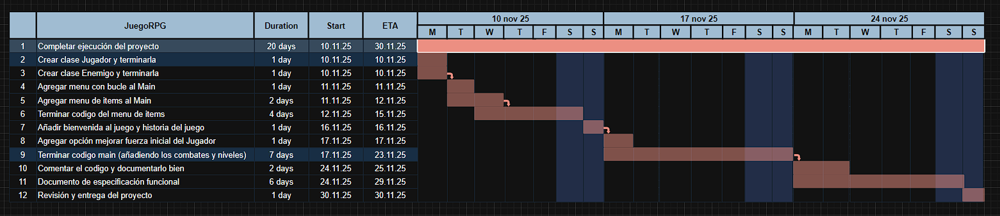

# ----- JuegoRPG -----

---

Este videojuego es un RPG de combate por turnos que sigue la historia de un aventurero en busca de respuestas. Al entrar en una misteriosa mazmorra, descubre que ha quedado atrapado en un laberinto mágico lleno de peligros.

Criaturas desconocidas acechan en cada parte de la mazmorra, obligándolo a luchar para poder sobrevivir. Su única esperanza es avanzar, derrotar a los enemigos y encontrar una salida antes de que la mazmorra lo consuma. ¿Serás capas de guiarlo hacia la libertad?

## Requisitos Funcionales

- RF-1: Interfaz / Menú Principal

RF-1.1 Mostrar menú principal  
RF-1.2 Seleccionar opción de luchar contra enemigo  
RF-1.3 Seleccionar opción de comprar ítems (tienda)  
RF-1.4 Consultar estadísticas del jugador  
RF-1.5 Salir del juego  

- RF-2: Jugador

RF-2.1 Introducir nombre del jugador  
RF-2.2 Calcular fuerza inicial aleatoria  
RF-2.3 Permitir mejorar fuerza inicial pagando oro  
RF-2.4 Modificar estadísticas (salud, ataque, defensa, oro, nivel)  
RF-2.5 Subir de nivel al ganar combates  
RF-2.6 Mostrar estadísticas del jugador  

- RF-3: Enemigos

RF-3.1 Generar enemigos según el nivel del jugador  
RF-3.2 Mostrar estadísticas del enemigo  
RF-3.3 Calcular fuerza o atributos aleatorios por tipo de enemigo  
RF-3.4 Soltar oro al morir  
RF-3.5 Generar jefe final cuando el jugador tiene nivel ≥5  

- RF-4: Combate

RF-4.1 Iniciar combate por turnos  
RF-4.2 Calcular daño entre jugador y enemigo  
RF-4.3 Detectar victoria o derrota  
RF-4.4 Entregar oro y experiencia al ganar  
RF-4.5 Finalizar el juego si se derrota al jefe final  

- RF-5: Tienda

RF-5.1 Mostrar ítems disponibles  
RF-5.2 Comprar ítems usando oro  
RF-5.3 Mejorar estadísticas según el ítem comprado  
RF-5.4 Comprobar que el jugador tiene suficiente oro  
RF-5.5 Salir de la tienda  

## Actores

- Jugador: Interactúa con el menú, combate enemigos, compra ítems, gestiona sus estadísticas y toma todas las decisiones del juego.

- Enemigo: Participa en los combates contra el jugador. Representa los desafíos de la mazmorra y tiene estadisticas segun el nivel del jugador

- Sistema / Juego: Controla la lógica interna; genera enemigos, inicia combates, calcula daño, administra la experiencia, el oro y la progresión.

- Tienda: Permite comprar ítems y mejorar atributos.

## Casos de uso

CU-1: Ingresar nombre del jugador  
CU-2: Calcular fuerza inicial del jugador  
CU-3: Cambiar fuerza inicial del jugador pagando oro  
CU-4: Elegir combatir contra enemigo  
CU-5: Generar enemigo aleatorio según nivel del jugador  
CU-6: Mostrar estadísticas del enemigo durante el combate  
CU-7: Iniciar combate por turnos  
CU-8: Calcular daño y actualizar salud del jugador y enemigo  
CU-9: Detectar victoria o derrota del jugador  
CU-10: Elegir ver tienda  
CU-11: Comprar ítems y actualizar estadísticas del jugador  
CU-12: Elegir ver estadísticas o salir del juego  

| Nº Caso de Uso | Actor             | Nombre de las acciones                    | Descripción                                                                                                                   | RF                             |
| -------------- | ----------------- | ----------------------------------------- | ----------------------------------------------------------------------------------------------------------------------------- | ------------------------------ |
| CU-1           | Jugador           | Ingresar nombre del jugador               | El jugador introduce su nombre al inicio del juego para crear el personaje.                                                   | RF-2.1                         |
| CU-2           | Jugador           | Calcular fuerza inicial del jugador       | Se genera aleatoriamente la fuerza inicial del jugador al comenzar la partida.                                                | RF-2.2                         |
| CU-3           | Jugador           | Cambiar fuerza inicial del jugador        | El jugador puede mejorar su fuerza inicial pagando oro para aumentar su poder de ataque.                                      | RF-2.3                         |
| CU-4           | Jugador           | Elegir combatir contra enemigo            | El jugador selecciona la opción de luchar desde el menú principal para iniciar un combate.                                    | RF-1.2                         |
| CU-5           | Sistema / Enemigo | Generar enemigo aleatorio                 | El sistema crea un enemigo con estadísticas ajustadas al nivel del jugador.                                                   | RF-3.1, RF-3.3                 |
| CU-6           | Sistema / Enemigo | Mostrar estadísticas del enemigo          | Se muestran los puntos de ataque, defensa y salud del enemigo antes de iniciar el combate.                                    | RF-3.2, RF-5.4                 |
| CU-7           | Jugador / Enemigo | Iniciar combate por turnos                | Se desarrolla el combate por turnos entre jugador y enemigo, alternando ataques y defensa.                                    | RF-4.1, RF-4.2, RF-4.3         |
| CU-8           | Jugador / Sistema | Calcular daño y actualizar salud          | Se calcula el daño del jugador y del enemigo según ataque y defensa, y se actualizan las estadísticas de salud.               | RF-4.1, RF-4.2                 |
| CU-9           | Sistema / Jugador | Detectar victoria o derrota               | El sistema determina si el jugador gana o pierde el combate y aplica consecuencias como oro, subida de nivel o fin del juego. | RF-4.3, RF-4.4, RF-2.5, RF-4.5 |
| CU-10          | Jugador           | Elegir ver tienda                         | El jugador accede a la tienda desde el menú principal para ver los ítems disponibles.                                         | RF-1.3, RF-5.1                 |
| CU-11          | Jugador / Tienda  | Comprar ítems y actualizar estadísticas   | El jugador compra armas, armaduras o pociones y sus estadísticas se actualizan según el ítem adquirido.                       | RF-5.2, RF-5.3, RF-5.4, RF-5.5 |
| CU-12          | Jugador           | Elegir ver estadísticas o salir del juego | El jugador puede consultar sus estadísticas o seleccionar salir del juego desde el menú principal.                            | RF-1.4, RF-1.5, RF-2.6         |

## Diagrama de casos de uso

## Diagrama de clase

## Diagrama de gantt

---